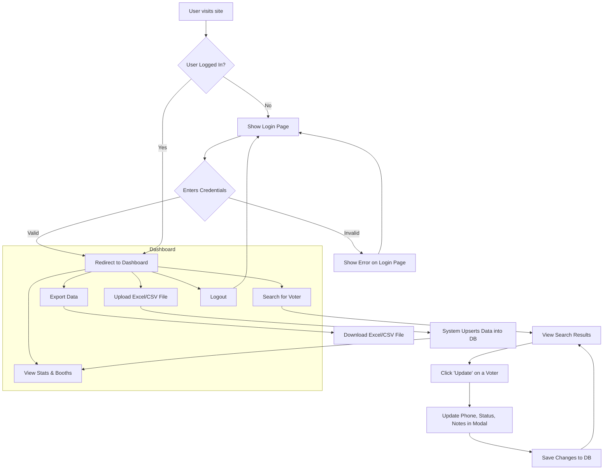

# Application Workflow

This document outlines the user workflow for the Voter Management System.

```mermaid
graph TD
    A[User visits site] --> B{User Logged In?};
    B -- No --> C[Show Login Page];
    C --> D{Enters Credentials};
    D -- Valid --> E[Redirect to Dashboard];
    D -- Invalid --> F[Show Error on Login Page];
    F --> C;
    
    B -- Yes --> E;

    subgraph Dashboard
        E --> G[View Stats & Booths];
        E --> H[Upload Excel/CSV File];
        E --> I[Search for Voter];
        E --> J[Export Data];
        E --> K[Logout];
    end

    H --> L[System Upserts Data into DB];
    L --> G;

    I --> M[View Search Results];
    M --> N[Click 'Update' on a Voter];
    N --> O[Update Phone, Status, Notes in Modal];
    O --> P[Save Changes to DB];
    P --> M;

    J --> Q[Download Excel/CSV File];
    K --> C;
```